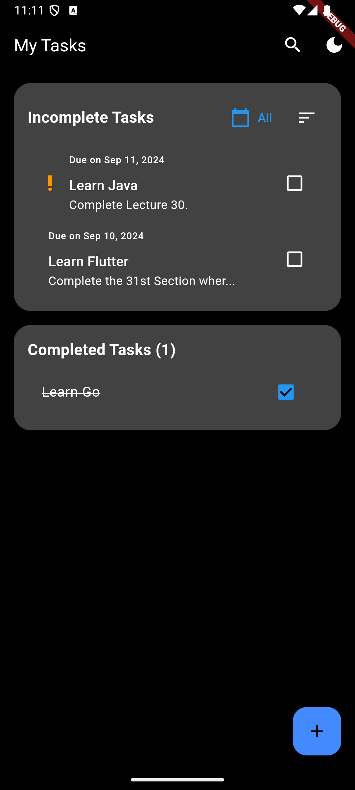
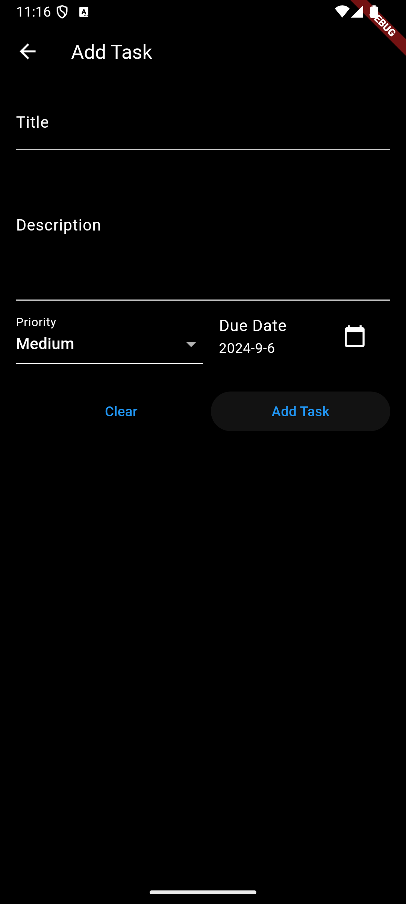
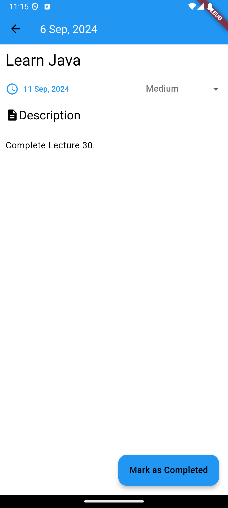

# Task Management Flutter App

A simple and efficient Task Management app built using Flutter. This app allows users to create, manage, and view tasks with the help of a clean and intuitive interface. The app also supports saving user preferences for sorting tasks and theme selection using SharedPreferences, and state management is handled using Riverpod.

## Features

- **Task Management**: Users can create, edit, and delete tasks.
- **Three Different Screens**:
  - **Task List Screen**: Displays a list of tasks with sorting options.
  - **Task Add Screen**: Allows users to add new tasks.
  - **Task Detail Screen**: Displays detailed information about a selected task.
- **User Preferences**: The app saves user preferences such as `sortType` and `theme` using SharedPreferences.
- **State Management**: Efficient and reactive state management using Riverpod.
- **Theme Switching**: Supports light and dark theme modes based on user preference.
- **Task Sorting Options**: Users can sort tasks by different criteria such as date, priority, or title.
- **Search Feature**: Easily search tasks to find the one you need quickly.
- **Task Prioritization**: Assign priorities to tasks to manage them more effectively.

## Screenshots

Task List Screen  



Task Add Screen  



Task Detail Screen  



## Installation

To run the app locally, follow these steps:

1. **Clone the repository**:
    ```bash
    git clone https://github.com/yourusername/task-management-flutter-app.git
    cd task-management-flutter-app
    ```

2. **Install dependencies**:
    ```bash
    flutter pub get
    ```

3. **Run the app**:
    ```bash
    flutter run
    ```

## Dependencies

The app uses the following major dependencies:

- **Flutter**: For building the cross-platform mobile app.
- **Riverpod**: For state management.
- **SharedPreferences**: For saving user preferences such as `sortType` and `theme`.
- **Provider**: For dependency injection and managing app-wide state.
  
To view the complete list of dependencies, refer to the `pubspec.yaml` file.

## Folder Structure

The app follows a clean folder structure:

```
lib/
|-- main.dart                 // App entry point
|-- models/                   // Data models for the app
|-- providers/                // Riverpod providers for state management
|-- screens/
|   |-- task_list_screen.dart  // Screen to list tasks
|   |-- task_add_screen.dart   // Screen to add new tasks
|   |-- task_detail_screen.dart // Screen to view task details
|-- services/
|   |-- shared_preferences_service.dart // Service to handle SharedPreferences logic
|-- widgets/                  // Custom reusable widgets
```

## How to Use

1. **Task List Screen**: View all your tasks in a sorted manner. You can switch between sorting options like date, priority, and title.
2. **Task Add Screen**: Add new tasks with details such as title, description, and priority.
3. **Task Detail Screen**: View and edit the details of a task.

## Customization

- **Theme Preferences**: You can switch between light and dark themes from the settings menu. The selected theme is stored using SharedPreferences.
- **Task Sorting**: Choose your preferred sorting method (e.g., by date, title, or priority). Your preference is saved and loaded automatically on app restart.

## Contributing

Contributions are welcome! Please fork the repository and submit a pull request for any improvements or features you'd like to add.

## License

This project is licensed under the MIT License - see the [LICENSE](LICENSE) file for details.

## Contact

For any questions or inquiries, please contact:

- Your Name: [Your Email](mailto:your-email@example.com)
- GitHub: [@yourusername](https://github.com/yourusername)

---

Feel free to adjust the sections according to your specific project details, such as your repository URL, contact information, and other customization options.